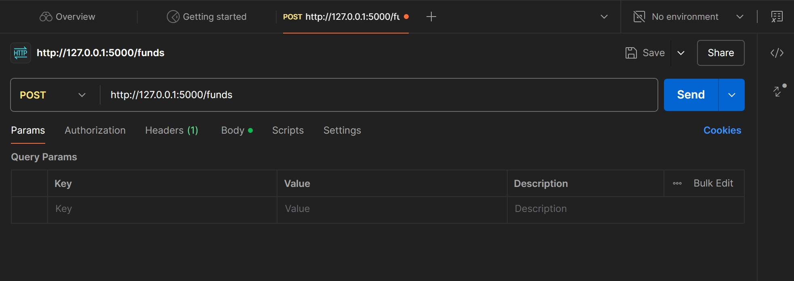

# Task 2: REST API Development Using Python and a web framework of your choice (e.g., Flask or Django)

## Question:

Create a RESTful API to manage investment funds. The API should have the following endpoints
o Endpoint to retrieve a list of all funds
o Endpoint to create a new fund
o Endpoint to retrieve details of a specific fund using its ID
o Endpoint to update the performance of a fund using its ID
o Endpoint to delete a fund using its ID

## Answer:

#### Project Name: Investment Fund API
A RESTful API for managing investment funds using Flask. The project will use Postman for API interaction given the user-friendliness and better graphical interface.

#### Basic Requirements
- Python 3.x
- Flask
- Postman software. Available to download here: [Postman Download Website](https://learning.postman.com/docs/getting-started/installation/installation-and-updates/#install-postman-on-windows)

##### Basic Requirements: Code Breakdown (AHAM.py)
In the 'AHAM.py', fund details will be stored as a list temporarily and API endpoints are assigned accordingly with proper error handling using HTTP response codes such as 200 for successful process, 404 for fund not found, 201 for fund created. Below are the endpoints created:

- `GET /funds`: Retrieves all available funds as a JSON list.
- `POST /funds`: Creates a new fund by accepting JSON input (e.g., fund details).
- `GET /funds/<fund_id>`: Fetches the details of a specific fund using its unique ID.
- `PUT /funds/<fund_id>`: Updates the performance of a specific fund using JSON input.
- `DELETE /funds/<fund_id>`: Deletes a fund with the given ID.

#### Guidelines
1. Clone the repository.
2. Install dependencies with `pip install -r test_requirements.txt`.
3. Run the application: `AHAM.py`. The API will  be accessible at http://127.0.0.1:5000/
4. Open your installed Postman software.

##### Guidelines: Accessing via Postman. !! Make sure the Flask server is running !!
1. For API testing, execute HTTP response by choosing the endpoints accordingly. 
2. For POST:
    i.   Create a new request.
    ii.  Select POST as the HTTP method.
    iii. Enter the URL http://127.0.0.1:5000/funds.
    iv.  Go to the Body tab in Postman and select raw format.
    v.   Paste the JSON body of the new fund.
    vi.  Set the header Content-Type to application/json.
    vii. Click Send to create the fund.
3. For PUT (update):
    i.   Create a new request.
    ii.  Select PUT as the HTTP method.
    iii. Enter the URL with the fund ID. Example: http://127.0.0.1:5000/funds/223
    iv.  Go to the Body tab and select raw format.
    v.   Paste the JSON body of the updated field.
    vi.  Set the header Content-Type to application/json.
    vii. Click Send to update the fund.
4. For DEL and GET, just simply specify the URL with the fund ID similar to PUT (don't specify fund ID if to retrieve all)

