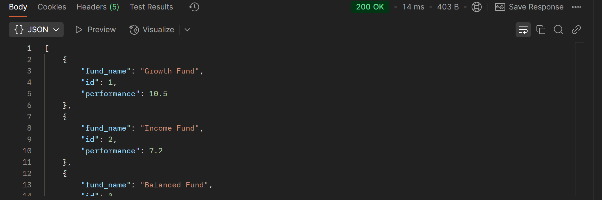

# AFFIN HWANG ASSET MANAGEMENT TAKEAWAY TEST

## Objectives:
The purpose of this assessment is to evaluate the candidate's proficiency as a backend developer with a focus on Python and their understanding of building and working with RESTful APIs. The assessment aims to assess the candidate's ability to design, develop, and maintain scalable and efficient backend solutions for a fund management company.

### Task Breakdown
To properly visualized and documented the steps taken to answer the questions, the tasks are breakdown individually according to the folder from Task 1- 5. As for Task 6, 7 and 8 (with reference to Task 3,4 and 5), the code used are named as FlaskApp.py to provide comprehensive progress of the updated application.

#### Task 6: Error Handling.
Implement appropriate error handling mechanisms for the API to handle scenarios like invalid input, missing resources, etc.
##### Code: FlaskApp.py
As implemented as well in Task 2, error handling is implemented to ensure API operations can handle scenarios like invalid input, missing resources, and database errors. Below are the list of handling method used:

1. Error Handling:
- Validation Errors: Handles invalid or missing input data with detailed error messages (400 Bad Request)
- Database Integrity Errors: Handles unique constraint violations (409 Conflict).
- Resource Not Found: Returns 404 Not Found if a fund or resource doesn’t exist.
- Internal Server Errors: Handles unexpected errors with a generic 500 Internal Server Error message, including optional exception details.

2. Database Functions:
- initialize_database: Ensures the required database schema exists before starting the app
- get_db_connection: Simplifies connection management to the SQLite database.

3. Reusable Error Handlers:
- Provides consistent error responses for 404 Not Found and 500 Internal Server Error.

#### Task 7: Testing. 
Write test cases to ensure the proper functioning of both the API endpoints and the SQL database. The tests should cover various scenarios and edge cases, including testing the SQL queries and verifying data integrity in the database.
##### Code: FlaskApp.py and tPostman Software

##### Guide:
1. Run FlaskApp.py and Postman software.
2. Create new collection in Postman for better project overview
3. Add individual request for each testing

###### Endpoints Validation
1. GET /funds

Steps:
- Create a new request in your collection.
- Set the request type to GET.
- Set the URL to: http://127.0.0.1:5000/funds.
- Click Send to test the endpoint.

Expected Result:
- Status code: 200 OK.
- Response body: A JSON array of fund data (e.g., id, fund_name, and performance).

Validated sample:
 

2.

