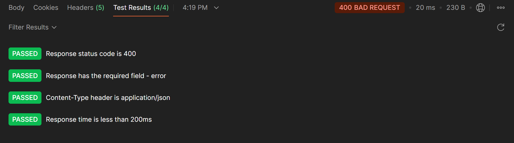

# AFFIN HWANG ASSET MANAGEMENT TAKEAWAY TEST: Documentation

## Objectives:
Provides an interface to manage investment funds and their data stored in the database. Users can perform CRUD (Create, Read, Update, Delete) operations on funds.

#### Basic Requirements
- Python 3.x
- SQLite
- Flask
- Postman software. Available to download here: [Postman Download Website](https://learning.postman.com/docs/getting-started/installation/installation-and-updates/#install-postman-on-windows)

### Task Breakdown
To properly visualized and documented the steps taken to answer the questions, the tasks are breakdown individually according to the folder from Task 1- 5. As for Task 6, 7 and 8 (with reference to Task 3,4 and 5), the code used are named as FlaskApp.py to provide comprehensive progress of the updated application.

#### Task 1-5

Summary:
Fund details will be stored as a list temporarily and API endpoints are assigned accordingly with proper error handling using HTTP response codes such as 200 for successful process, 404 for fund not found, 201 for fund created. Below are the endpoints created:

- `GET /funds`: Retrieves all available funds as a JSON list.
- `POST /funds`: Creates a new fund by accepting JSON input (e.g., fund details).
- `GET /funds/<fund_id>`: Fetches the details of a specific fund using its unique ID.
- `PUT /funds/<fund_id>`: Updates the performance of a specific fund using JSON input.
- `DELETE /funds/<fund_id>`: Deletes a fund with the given ID.

In TASK 5, the approach used is using SQLite3 library to convert created database (.db file) as jsonn without creating unnecessary output json file.

#### Database Details
1. funds.db

| id       | fund_name | Performance |
|----------|---------- |------------ |
| Value 1  | Value 2   | Value 3     |
| Value 4  | Value 5   | Value 6     |

2. investment_funds.db

| id       | fund_name | fund_type   | created_date | total_assets |
|----------|---------- |------------ |--------------|--------------|
| Value 1  | Value 2   | Value 3     | Value 4      | Value 5      | 

#### Task 6: Error Handling.
Implement appropriate error handling mechanisms for the API to handle scenarios like invalid input, missing resources, etc.
##### Code: FlaskApp.py
As implemented as well in Task 2, error handling is implemented to ensure API operations can handle scenarios like invalid input, missing resources, and database errors. Below are the list of handling method used:

1. Error Handling:
- Validation Errors: Handles invalid or missing input data with detailed error messages (400 Bad Request)
- Database Integrity Errors: Handles unique constraint violations (409 Conflict).
- Resource Not Found: Returns 404 Not Found if a fund or resource doesn’t exist.
- Internal Server Errors: Handles unexpected errors with a generic 500 Internal Server Error message, including optional exception details.

2. Database Functions:
- initialize_database: Ensures the required database schema exists before starting the app
- get_db_connection: Simplifies connection management to the SQLite database.

3. Reusable Error Handlers:
- Provides consistent error responses for 404 Not Found and 500 Internal Server Error.

#### Task 7: Testing. 
Write test cases to ensure the proper functioning of both the API endpoints and the SQL database. The tests should cover various scenarios and edge cases, including testing the SQL queries and verifying data integrity in the database.
##### Code: FlaskApp.py and tPostman Software

##### Guide:
1. Run FlaskApp.py and Postman software.
2. Create new collection in Postman for better project overview
3. Add individual request for each testing

##### Endpoints Validation
###### GET

1. Steps:
- Create a new request in the collection.
- Set the request type to GET.
- Set the URL to: http://127.0.0.1:5000/funds. If to specify certain fund use: http://127.0.0.1:5000/funds/id
- Click Send to test the endpoint.

2. Expected Result:
- Status code: 200 OK.
- Response body: A JSON array of fund data (e.g., id, fund_name, and performance).

3. Validated sample:

Body Output-----------------------------------------------------------------------------

 

Postman Testing-------------------------------------------------------------------------

###### POST

1. Steps:
- Create a new request in the collection.
- Set the request type to POST.
- Set the URL to: http://127.0.0.1:5000/funds/add.
- Go to the Body tab and choose raw, then set the content type to JSON.
- This JSON data sample is added:

2. Expected Result:
- Status code: 200 OK.
- Response body: A JSON array of fund data (e.g., id, fund_name, and performance).

3. Validated Sample:

Body Output-----------------------------------------------------------------------------

Postman Testing-------------------------------------------------------------------------

###### DELETE

1. Steps:
- Create a new request in the collection.
- Set the request type to DELETE.
- Set the URL to: http://127.0.0.1:5000/funds/delete/15 as the newly added fund have a id of 15.
- Click Send to test the endpoint.

2. Expected Result:
- Status code: 200 OK (if the fund exists).
- Status code: 404 Not Found (if the fund does not exist).
- Response body: A success or error message.

3. Validation Sample:

Body Output-----------------------------------------------------------------------------

Postman Testing-------------------------------------------------------------------------

##### Edge Cases

1. Providing missing inputs to POST method. 
Here, empty string of fund name and no performance is given.

Body Output-----------------------------------------------------------------------------

Postman Testing-------------------------------------------------------------------------

2. Non-existing records. 

Body Output-----------------------------------------------------------------------------

Postman Testing-------------------------------------------------------------------------

3. Duplicate. 
Using POST method, similar id is tested.

Body Output-----------------------------------------------------------------------------

Postman Testing-------------------------------------------------------------------------

